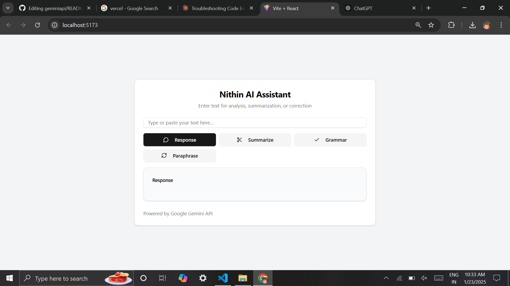

# Nithin AI Assistant

## Introduction
The Nithin AI Assistant is a web app that provides text analysis and manipulation capabilities using the Google Gemini API.

## Features
- Response generation
- Summarization
- Grammar correction
- Paraphrasing

## Usage
1. Enter text in the input field.
2. Click a button for the desired operation.
3. View the result in the "Response" section.

## Tech Stack
- React.js
- Google Gemini API
- Tailwind CSS
- Lucide icons
- shadcn/ui

## Setup
1. Clone the repo
2. Install dependencies (`npm install`)
3. Set Gemini API key in `.env` 
4. Start dev server (`npm run dev`)
5. Open app at `http://localhost:5173`

## Contributing
1. Fork the repo
2. Create a new branch
3. Make changes and commit
4. Push to your fork
5. Submit a pull request

## License
This project is licensed under the MIT License.
